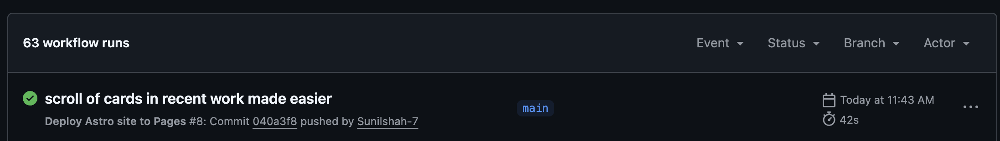
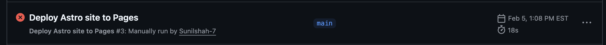

# Static website to present Nashman Center documentation

Honey W. Nashman Center for Civic Engagement and Public Service

The Honey W. Nashman Center supports the diverse ways GW faculty and students contribute to the community, including direct service; community engagement through courses, practica, or research that create a public benefit; policy and governance; philanthropy; social innovation; and community organizing and activism.

This GitHub organization is meant to hold Open Education Resources (OER) materials for civic learning.

### Technology used in this website

1. Astro - for building content rich website
2. Markdown file - for easier content formatting

### Why Astro?

1. A component-based web architecture optimized for content-driven websites.
2. Easier deployment to Github Pages for static website rendering
3. Supports React, Preact, Svelte, Vue, Solid, HTMX, web components, and more.
4. Less client-side JavaScript.

To know more about it, visit [Astro official documentation website](https://docs.astro.build/en/concepts/why-astro/)

### Deployment

This site is deployed from the **main** branch. Any change merged or pushed to `main` triggers a GitHub Actions workflow that builds the Astro site and publishes it to **GitHub Pages**.

**How GitHub Actions works here:**

1. A commit lands on `main` branch.
2. GitHub Actions runs the workflow configured for this repo.
3. The workflow installs dependencies, builds the site, and uploads the static output.
4. GitHub Pages serves the published build on `gw-nashman-center.github.io/`.
5. If your recent changes is not being reflected on the website, check FAQ on how to solve it.

**How to check deployment status:**

- Go to the **Actions** tab in this repository on top section.
- Open the latest workflow run on **Deploy Astro site to Pages** on the left side.
  
- If it shows a green checkmark, the deployment finished successfully.
  
- If it’s still running, the status will show **in progress**.
- If it failed, you’ll see a red ❌ and can open the run to view logs.
  
- If it has failed, follow the FAQ section on how to solve it.

### FAQ

1. The changes I made in local computer works, but doesnot reflect on deployment. Why is that?
   Answer: The site only updates when changes are pushed/merged to the `main` branch and the GitHub Actions workflow finishes successfully. Make sure your commits are on `main`, the latest workflow run is green in **Actions**, and your browser cache is cleared (or hard refresh).

2. The deployment process failed. What should I do?
   Answer: Open the failed run in the **Actions** tab, review the error logs, and fix the issue (commonly build errors, missing files, or dependency problems). After fixing, push a new commit to `main` to trigger a fresh deployment. If it still fails, compare with the last successful run to spot what changed.
